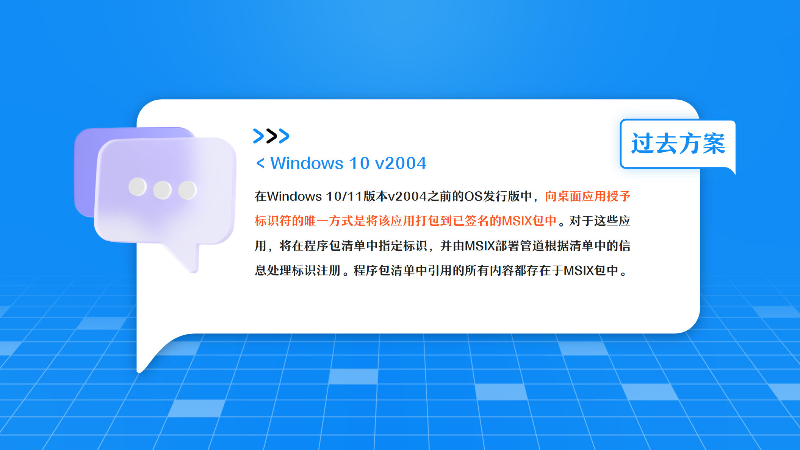
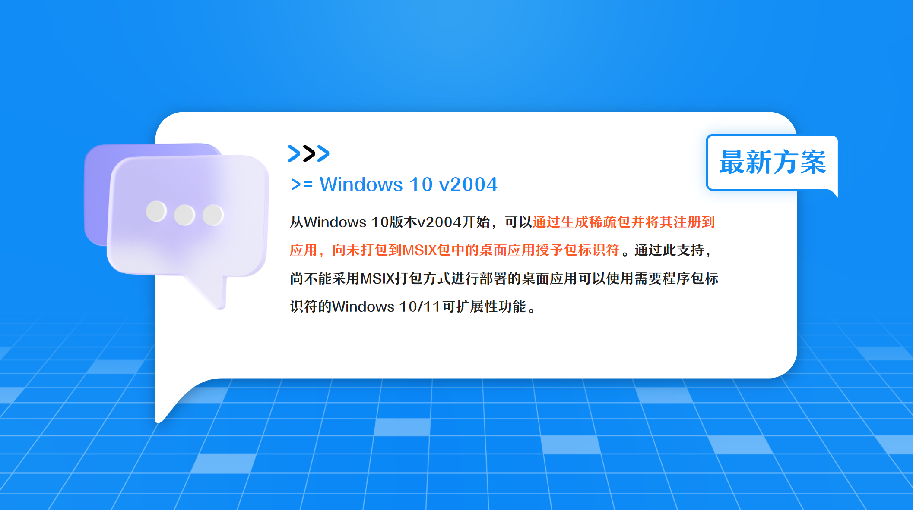

## 传统应用通过稀疏包(Sparse Package)插上现代的翅膀

许多Windows 10/11可扩展性功能需要在非UWP桌面应用中使用程序包标识符，包括**后台任务(BackgroundTasks)**、**通知(Notifications)**、**动态磁贴(LiveTiles)** 和**共享目标(Share)**。 对于这些情况OS需要使用标识来识别相应API的调用方。

在Windows 10版本v2004之前的OS发行版中，向桌面应用授予标识符的**唯一方式**是将**该应用打包到已签名的MSIX包中**。对于这些应用，将在程序包清单中指定标识，并由MSIX部署管道根据清单中的信息处理标识注册。**程序包清单中引用的所有内容都存在于MSIX包中**。

从Windows 10版本v2004开始，可以**通过生成稀疏包并将其注册到应用，向未打包到MSIX包中的桌面应用授予包标识符**。通过此支持，尚不能采用MSIX打包方式进行部署的桌面应用**可以使用需要程序包标识符的Windows 10/11可扩展性功能**。

## 相关文档

* [乘风破浪，遇见最美Windows 11之现代Windows桌面应用开发 - 传统应用通过稀疏包(Sparse Package)插上现代的翅膀](https://www.cnblogs.com/taylorshi/p/15818715.html)

## 相关截图

